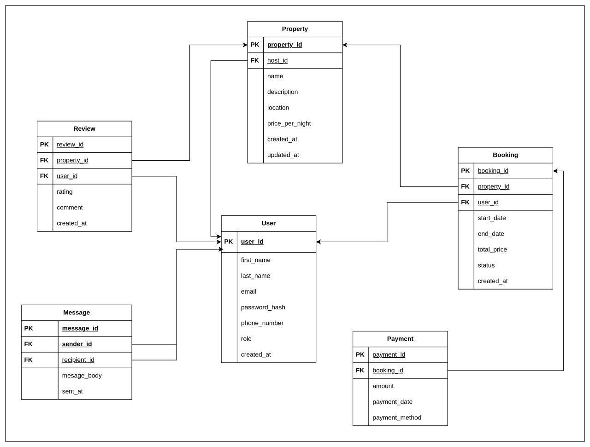

# Entity-Relationship Diagram

## 📌 Objective

Design and document the Entity-Relationship Diagram (ERD) for the AirBnB-style database system.

This ERD visually represents all entities, their attributes, and relationships as described in the database specification.

---

## 📉 ERD (Entity Relationship Diagram)

---

## ✅ Entities and Attributes

### 1. **User**

- `user_id` (UUID, PK, Indexed)
- `first_name` (VARCHAR, NOT NULL)
- `last_name` (VARCHAR, NOT NULL)
- `email` (VARCHAR, UNIQUE, NOT NULL)
- `password_hash` (VARCHAR, NOT NULL)
- `phone_number` (VARCHAR, NULL)
- `role` (ENUM: guest, host, admin, NOT NULL)
- `created_at` (TIMESTAMP, DEFAULT CURRENT_TIMESTAMP)

---

### 2. **Property**

- `property_id` (UUID, PK, Indexed)
- `host_id` (UUID, FK → User.user_id)
- `name` (VARCHAR, NOT NULL)
- `description` (TEXT, NOT NULL)
- `location` (VARCHAR, NOT NULL) _(Consider extracting to a Location entity for normalization)_
- `pricepernight` (DECIMAL, NOT NULL)
- `created_at` (TIMESTAMP, DEFAULT CURRENT_TIMESTAMP)
- `updated_at` (TIMESTAMP, ON UPDATE CURRENT_TIMESTAMP)

---

### 3. **Booking**

- `booking_id` (UUID, PK, Indexed)
- `property_id` (UUID, FK → Property.property_id)
- `user_id` (UUID, FK → User.user_id)
- `start_date` (DATE, NOT NULL)
- `end_date` (DATE, NOT NULL)
- `total_price` (DECIMAL, NOT NULL)
- `status` (ENUM: pending, confirmed, canceled, NOT NULL)
- `created_at` (TIMESTAMP, DEFAULT CURRENT_TIMESTAMP)

---

### 4. **Payment**

- `payment_id` (UUID, PK, Indexed)
- `booking_id` (UUID, FK → Booking.booking_id)
- `amount` (DECIMAL, NOT NULL)
- `payment_date` (TIMESTAMP, DEFAULT CURRENT_TIMESTAMP)
- `payment_method` (ENUM: credit_card, paypal, stripe, NOT NULL)

---

### 5. **Review**

- `review_id` (UUID, PK, Indexed)
- `property_id` (UUID, FK → Property.property_id)
- `user_id` (UUID, FK → User.user_id)
- `rating` (INTEGER, CHECK: rating between 1 and 5, NOT NULL)
- `comment` (TEXT, NOT NULL)
- `created_at` (TIMESTAMP, DEFAULT CURRENT_TIMESTAMP)

---

### 6. **Message**

- `message_id` (UUID, PK, Indexed)
- `sender_id` (UUID, FK → User.user_id)
- `recipient_id` (UUID, FK → User.user_id)
- `message_body` (TEXT, NOT NULL)
- `sent_at` (TIMESTAMP, DEFAULT CURRENT_TIMESTAMP)
