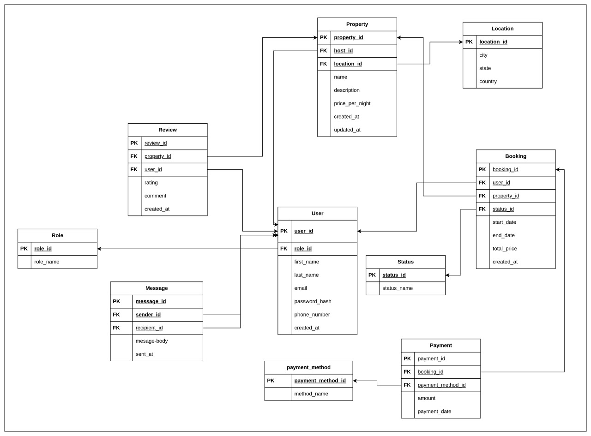

# Normalization Steps to Achieve 3NF – AirBnB Database

## Objective

To normalize the AirBnB database schema by eliminating redundancy and ensuring that it conforms to the third normal form (3NF).

---

## Step 1: First Normal Form (1NF)

- All tables have primary keys defined
- No repeating groups or arrays
- Each column contains atomic values (single values)

---

## Step 2: Second Normal Form (2NF)

- Tables satisfy 1NF
- Non-key attributes fully depend on the primary key
- Created separate tables for entities:
  - Split `Role` from `User` table
  - Split `Location` from `Property` table
  - Split `State` from `Booking` table
  - Split `Payment_Method` from `Payment`

---

## Step 3: Third Normal Form (3NF)

- Tables satisfy 2NF
- No transitive dependencies (non-key attributes don't depend on other non-key attributes)
- Eliminated transitive dependencies by:
  - Making location details (city, state, and country) part of a separable Location table
  - Creating a separate Status table rather than using an ENUM
  - Creating a sepate Payment_Method table rather than using an ENUM

# Why this Normalization Decisions made?

## 1. User Role Normalization

- **Original**: ENUM field in User table (`guest, host, admin`)
- **Normalized**: Separate Role table with `role_id` and `role_name`
- **Benefit**: Allows for future role expansion without schema change

## 2. Location Normalization

- **Original**: VARCHAR field in Property table
- **Normalized**: Separate Location table with `city`, `state`, and `country`
- **Benefit**: Enable location based queries and avoids data duplication

## 3. Booking Status Normalization

- **Original**: ENUM field in Booking table (`pending, confirmed, canceled`)
- **Normalized**: Separate Status table with `status _id` and `status_name`
- **Benefit**: Allows for additional statuses and better querying

## 4. Payment Method Normalization

- **Original**: ENUM field in Payment table (`credit_card, paypal, stripe`)
- **Normalized**: Separate Payment_Method table
- **Benefit**: Supports adding new payment methods without schema changes

---

## 📉 Final Normalized ERD

