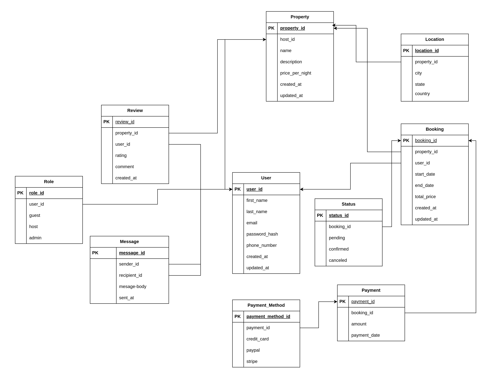

# Normalization Steps to Achieve 3NF – AirBnB Database

## Objective

To normalize the AirBnB database schema by eliminating redundancy and ensuring that it conforms to the third normal form (3NF).

---

## Step 1: First Normal Form (1NF)

- All attributes are atomic (no multi-valued or repeating fields).
- Each entity has a primary key to uniquely identify records.

---

## Step 2: Second Normal Form (2NF)

- The schema uses single-column UUIDs as primary keys; no partial dependencies exist.
- All non-key attributes fully depend on the primary key.

---

## Step 3: Third Normal Form (3NF)

- Created `Location` entity to reduce redundancy, improve queryability, and bring flexibility.
- Created a new entities like `Role`, `Status`, and `Payment_Method` if there is a need for modification or extending. But this was completely optional.

---

## 📉 Final Normalized ERD

